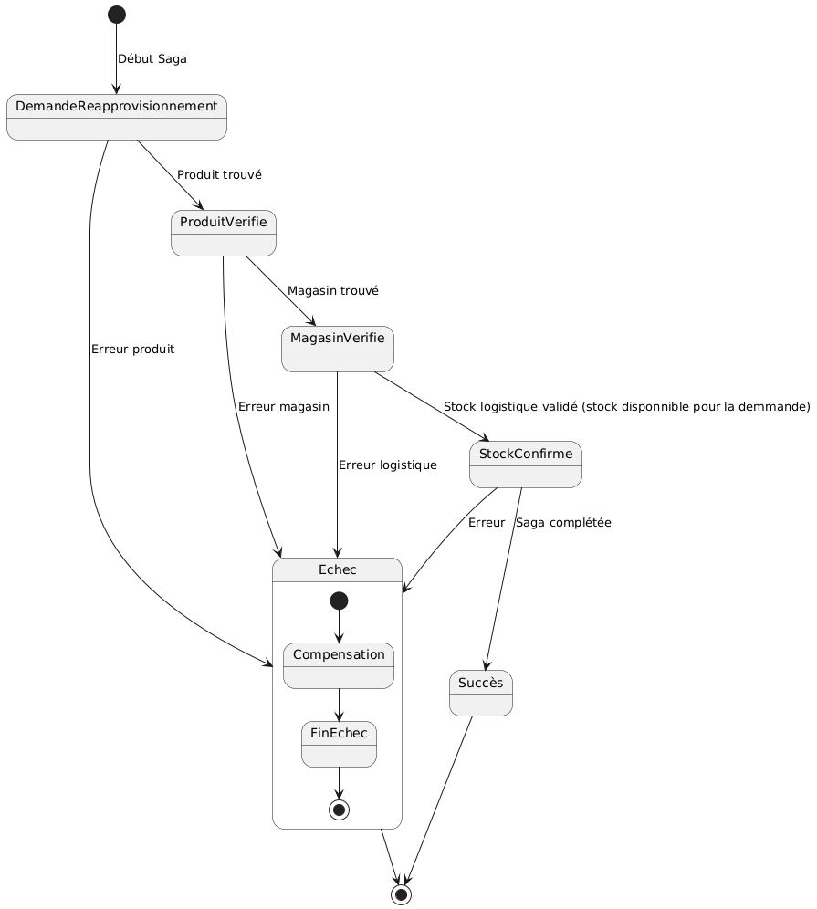
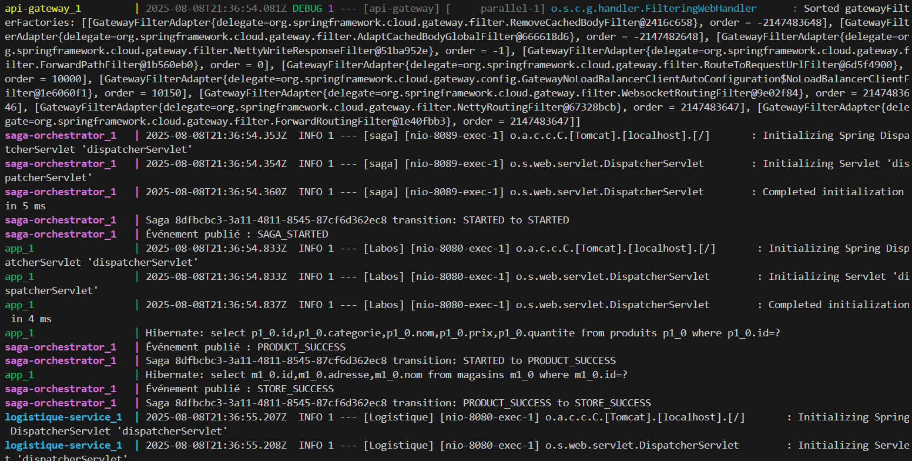
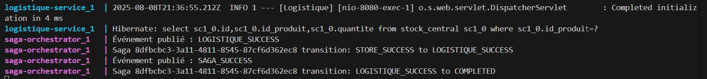

# Lab 6

## Le scénario métier et la saga implémentée

Le scénario métier choisi été le réapprovisionnement produit:

- Demande de réapprovisionnement initiée
- Validation du produit (existe)
- Vérification du magasin cible (existe)
- Confirmation du stock logistique (stock disponnible pour la demande)
- Succès ou échec avec compensation

## Le diagramme de la machine d’état

Voici le diagramme de la machine d'état

## Les décisions d’architecture

Aucun ADR n'a été fait durant ce lab.

## Les mécanismes de compensation

- Produit innexistant: la demande n'est pas créée, aucun rollback.
- Magasin innexistant: la demande n'est pas créée, aucun rollback.
- Stock insufisant pour la demande: la demande n'est pas créée, aucun rollback.

## Screenshot des logs

