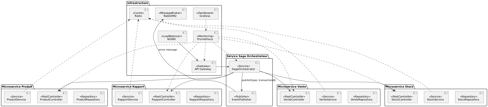
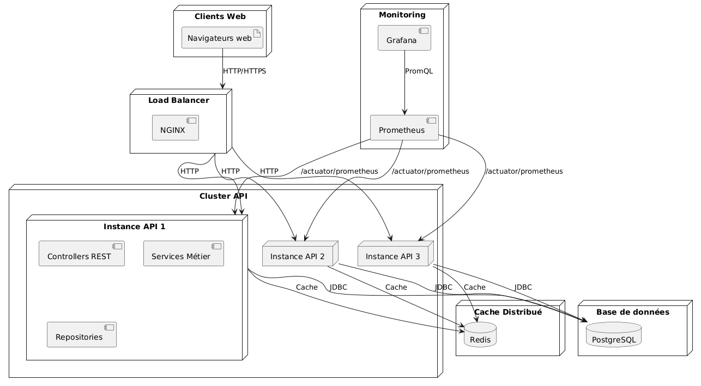

# Nom
Anass Chiba

# URL Github

https://github.com/Anass1707/LOG430-labos

# Analyse et continuité

## Résumer du Lab 0 et 1
Durant les Labs 0 et 1, l'application a été construite selon une architecture en couches simple et respecte partiellement l'architecture MVC :

- Utilisation de @RestController pour exposer les endpoints.

- Les entités, services et contrôleurs étaient tous organisés dans des dossiers uniques communs (Controller, services, entities).

- La logique métier était relativement directement codée dans les services.

- L’interface utilisateur n’était pas présente (pas de vues HTML), uniquement des échanges JSON (API REST).

## Éléments conservés et modifiés

Pour le labo 2, j'ai conservé l'architecture MVC, j'ai amélioré la structure des dossiers pour favoriser une organisation par domaine pour plus de lisibilité et scalabilité et j'ai passé de @RestController à @Controller pour supporter les vues Thymleaf que j'ai intégré comme interface utilisateur.

## Exigences introduites au lab 2

- Ajout d’une interface utilisateur minimaliste via des vues Thymeleaf.

- Séparation claire des domaines métiers (Logistique, Vente, Magasin, Utilisateur, Produit).

## Défis architecturaux

* Réorganisation du projet selon DDD.

* Intégration complète du MVC avec vues (Thymeleaf).

* Cohérence transactionnelle entre services.

* Gestion de la croissance de la complexité métier.


## Les sous-domaines fonctionnels 

Le système développé pour la gestion des magasins, d'un centre logistique et une maison mère est composé en quatre sous-domaines métiers:

- Logistique:
Il permet la gestion du stock central et les demandes de réaprovisionnement. Les modèles associés sont: DemandeReaprovisionnement et StockCentral.

- Magasin:
Il permet de créer les rapports des magasins et la gestion de leurs stocks. Les modèles associés sont: Magasin et StockMagasin.
- Produit:
Il permet la gestion des produits. Le modèle associé est: Produit.
- Vente:
Il permet la gestion des ventes et des retours. Les modèles associés sont: Vente, Retour, LigneVente.

- Utilisateur:
Il permet la gestion des utilisateurs. Le modèle associé est: Utilisateur.

# 1. Introduction et objectifs

Ce projet est une application web de gestion logistique pour une chaîne de magasins. Il permet la gestion centralisée des stocks, le suivi des ventes, le réapprovisionnement, la génération de rapports et la visualisation des performances via un tableau de bord.

**Objectifs principaux :**
- Optimiser la gestion des stocks entre le centre logistique et les magasins.
- Faciliter le suivi des ventes.
- Offrir une interface web simple pour les gestionnaires et employés.

---

# 2. Contraintes

- Utilisation de Java, Spring Boot, Thymeleaf, Hibernate/JPA, PostgreSQL
- Interface web accessible sur navigateur web
- Synchronisation automatique des données entre le centre et les magasins

---

# 3. Contexte

**Diagramme de contexte (simplifié) :**

```
[Gestionnaire]         [Employé magasin]         [Responsable logistique]
      |                        |                          |
      |                        |                          |
      +------------------------+--------------------------+
                               |
                        [Application Web]
                               |
                +--------------+--------------+
                |                             |
        [Base de données]             [Système d’alerte]
```

---

# 4. Solution conceptuelle

- **Gestion des stocks** : Stock central et stocks magasins synchronisés, gestion des ruptures et surstocks.
- **Réapprovisionnement** : Demandes initiées par les magasins, validées par le centre logistique.
- **Rapports** : Génération de rapports consolidés sur les ventes, stocks, produits les plus vendus.
- **Tableau de bord** : Indicateurs clés (alertes, tendances) accessibles aux gestionnaires.
- **Alertes automatiques** : Notification en cas de seuil critique de stock.

---

# 5. Scénarios d’utilisation

- Générer un rapport des ventes
- Consulter le stock central 
- Déclencher un réapprovisionnement
- Visualiser les performances des magasins dans un tableau de bord
- Mettre à jour les produits depuis la maison mère
- Approvisionner un magasin depuis le centre logistique

---

# 6. Architecture logicielle

- **Contrôleurs Spring MVC** : gestion des routes et des vues
- **Services** : logique métier 
- **Entités JPA** : Magasin, Produit, StockCentral, StockMagasin, Vente, DemandeReapprovisionnement
- **Repositories** : accès aux données
- **Vues Thymeleaf** : pages web pour chaque fonctionnalité

---

# 7. Déploiement

- Application packagée en .jar
- Déploiement sur serveur Linux avec Java 21+, PostgreSQL
- Accès via navigateur web

---

# 8. Qualité et sécurité

- Gestion des erreurs et des exceptions
- Sauvegarde régulière de la base de données

---

# 9. Glossaire

- **Stock central** : stock principal au centre logistique
- **Stock magasin** : stock local à chaque magasin
- **Réapprovisionnement** : processus de demande et de transfert de stock
- **Gestionnaire** : utilisateur ayant accès aux rapports et au tableau de bord
- **Responsable logistique** : valide les demandes de réapprovisionnement

---

# 10. Annexes

- Diagrammes UML (cas d’utilisation, séquence, classes)

<div style="page-break-after: always;"></div>

## Diagrammes

### Diagramme de classes

<div style="page-break-after: always;"></div>

### Diagramme de composants

<div style="page-break-after: always;"></div>

### Diagramme de séquence : Création d’une demande

<div style="page-break-after: always;"></div>

### Diagramme de séquence : Rapport détaillé

<div style="page-break-after: always;"></div>

### Diagramme de séquence : Consulter Stock Central

<div style="page-break-after: always;"></div>


### Diagramme de séquence : Visualiser Tableau Bord

<div style="page-break-after: always;"></div>

### Diagramme de deploiement

<div style="page-break-after: always;"></div>

### Diagramme de cas d'utilisation


---