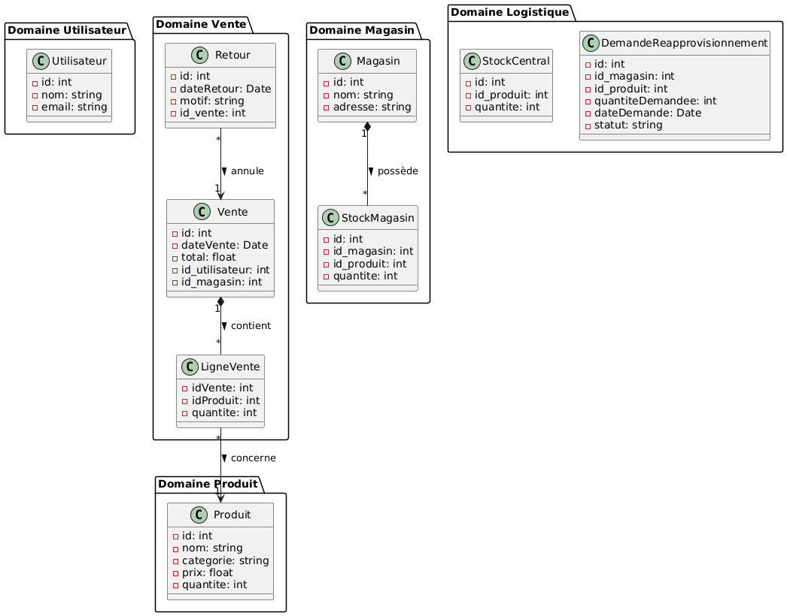
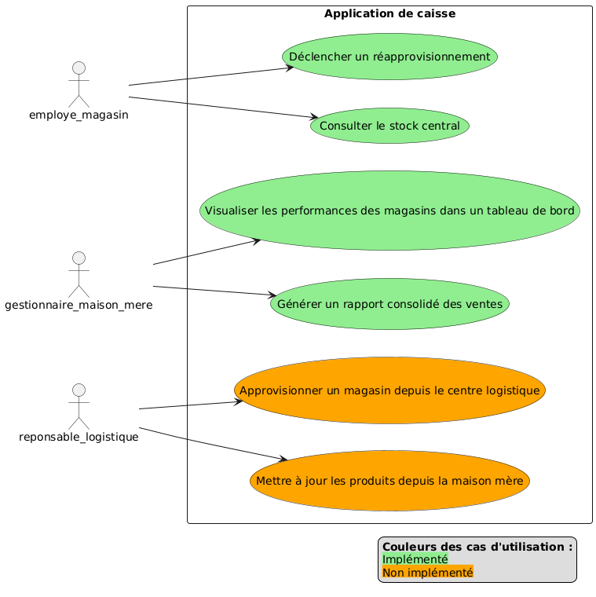

# Rapport arc42

## Nom
Anass Chiba

## URL Github

https://github.com/Anass1707/LOG430-labos

## 1. Introduction et objectifs
Ce projet vise à concevoir et faire évoluer une application backend suivant les bonnes pratiques architecturales. L’objectif est de progresser vers une solution robuste, performante et modulaire.

## 2. Contexte et portée
- **Labo3** : API RESTful monolithique orientée MVC
- **Labo5** : Système distribué avec microservices, API Gateway, sécurité et logging

## 3. Parties prenantes
- **Développeur** : Anass Chiba
- **Utilisateurs** : Prof et chargés de lab pour évaluation
- **Infrastructure** : Docker, NGINX, Redis, outils de test et observabilité

## 4. Architecture globale

| Labo       | Type d'architecture           | Éléments clés                                                               |
|------------|-------------------------------|-----------------------------------------------------------------------------|
| Labo3      | Monolithe MVC                 | API RESTful, Swagger                                                        |
| Labo4      | Monolithe optimisé            | Tests de charge K6, Load Balancer NGINX, Cache Redis, Monitoring Prometheus/Grafana |
| Labo5      | Microservices                 | API Gateway, sécurité CORS, système de logs                                 |

## 5. Décisions architecturales majeures
- Structure MVC pour lisibilité et modularité
- Swagger pour la documentation automatique
- K6 pour les tests de performance
- NGINX pour l’équilibrage de charge
- Redis pour l’optimisation des performances
- Monitoring avec Prometheus & Grafana pour les métriques et la visualisation
- Migration vers des microservices
- API Gateway pour la sécurité et la supervision

## 6. Qualités architecturales
- **Scalabilité** : microservices, NGINX
- **Performance** : Redis, K6
- **Documentation** : Swagger
- **Modularité** : séparation des services
- **Sécurité** : CORS, Gateway
- **Observabilité** : système de logs

## 7. Déploiement et infrastructure
- Conteneurisation via Docker
- NGINX pour la gestion du trafic
- Redis pour le cache distribué
- API Gateway en frontal

## 8. Dettes techniques
- Implémentation d'au moins deux autres microservices
- Faire une analyse approfondie sur la performance des deux architectures
- Gestion de la sécurité
- Implémentation d'au moins 2 autres APIs
- Ajout des tests
- Mise à jour du readme

## 9. Défis rencontrés
- J'ai perdu beaucoup de temps avec la mise en place de redis. J'ai eu un problème de serialisation et par la suite 
un problème de desérialisation. J'ai essayé de l'appliquer sur tout mes requêtes mais ce n'était pas necessaire.
- J'ai pris un peu plus de temps que je pensais pour la configuration de Spring Cloud Gateway.

## 10. Annexe
### ADRs
```md
#  ADR 03: Choix de cache

## Statut :
    Accepté – 15 juillet 2025

## Contexte :
Dans le cadre du projet LOG430, les microservices manipulent des données provenant de bases de données relationnelles (PostgreSQL).
Certaines de ces données sont consultées très fréquemment (produits, ventes, etc), mais peu modifiées.
Afin d’améliorer les performances, réduire la charge sur la base de données, et accélérer les temps de réponse, il fallait mettre en place une stratégie de cache efficace.

## Décision :
J'ai choisi d’utiliser Redis comme système de cache distribué pour ce projet.

## Justification :
Les raisons de ce choix sont les suivantes :
- Support natif dans Spring Boot: Intégration facile avec les annotations @Cacheable, @CachePut, @CacheEvict.
- Facile à déployer avec Docker: Une simple image Redis suffit, ajoutée au docker-compose.yml du projet.
- Cache distribué: Redis peut être utilisé par plusieurs microservices connectés dans le même réseau Docker.

## Conséquences :
- Redis sera démarré dans Docker via le service redis dans docker-compose.yml.

- Chaque microservice pourra accéder à Redis en utilisant SPRING_REDIS_HOST=redis.

- Les données mises en cache devront être explicitement marquées via les annotations @Cacheable, etc.


## Alternatives considérées :
- Ehcache: Fonctionne uniquement en mémoire locale, non adapté à un environnement Docker multi-services.
- Memcached: Moins flexible, ne gère pas nativement la persistance et les structures complexes.
```

```md
#  ADR 04: Choix d'API Gateway

## Statut :
    Accepté – 15 juillet 2025

## Contexte :
    
Dans le cadre du projet LOG430, l’architecture cible repose sur plusieurs microservices déployés via Docker :

- un service monolithique (app),

- un service de gestion des ventes (ventes-service),

- potentiellement d’autres services à venir.

Il est nécessaire de mettre en place une API Gateway afin de centraliser :

- les entrées réseau vers les services backend,

- la gestion du routing,

- la sécurité (CORS, authentification),

- le logging des requêtes,

- la scalabilité future.
## Décision :
J'ai choisi d'intégrer Spring Cloud Gateway comme API Gateway.

## Justification :
Les raisons principales de ce choix sont :

- Intégration native avec Spring Boot

    - Compatible avec tous les microservices Spring Boot du projet.

    - Configuration simple via application.properties ou Java.
- Personnalisation simple

    - Développement de filtres Java très accessible pour gérer CORS, sécurité, logs, etc.
- Déploiement facile en Docker

    - Il peut directement router vers les services par nom (ventes-service, app, etc.).

## Conséquences :

- Le port exposé pour l’accès aux services sera désormais centralisé via l’API Gateway (ex: localhost:8088/api/v1/...).

- Les services ne seront plus exposés directement aux clients.

- Les futures optimisations comme le caching, ou l’authentification OAuth2 pourront être ajoutées facilement via des filtres Gateway.

## Alternatives considérées :

- Nginx: Nécessite une configuration plus complexe et séparée et moins dynamique.
- Kong: Puissant, mais complexe à configurer et surdimensionné pour un projet académique.
```
### Diagrammes
### Diagramme de classes

<div style="page-break-after: always;"></div>

### Diagramme de composants

<div style="page-break-after: always;"></div>

### Diagramme de séquence : Création d’une demande

<div style="page-break-after: always;"></div>

### Diagramme de séquence : Rapport détaillé

<div style="page-break-after: always;"></div>

### Diagramme de séquence : Consulter Stock Central

<div style="page-break-after: always;"></div>


### Diagramme de séquence : Visualiser Tableau Bord

<div style="page-break-after: always;"></div>

### Diagramme de deploiement

<div style="page-break-after: always;"></div>

### Diagramme de cas d'utilisation


---
## Commentaires:
- Labos très intéréssants, j'ai utilisé de nouvelles technologies et j'ai expérimenté de nouvels outils que je n'ai pas eu encore la chance d'explorer sur le marché d'emploi.
- J'aurai aimé implémenté plus de chose mais j'ai pris du retard durant les 2 semaines d'intras et une semaine ou j'étais malade.

---