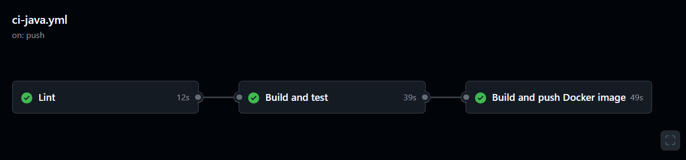
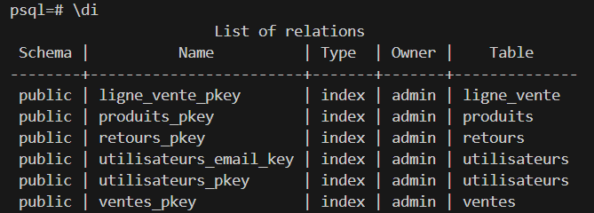

# LOG430-labos
LOG430-labo est une API Rest qui permet de gérer un système de caisse via des requettes HTTP. Vous pouvez consulter [les diagrammes liés à ce projet ](diagrammes.md).

# Besoins fonctionnels

## Gestion des produits
1. Rechercher un produit par identifiant, nom ou catégorie.
2. Afficher les détails d’un produit .
3. Consulter le stock.

## Gestion des ventes
1. Enregistrer une vente.
2. Créer une vente (produit selection de produits).
3. Annuler une vente

# Besoins non-fonctionnels

## Maintenabilité
- Code organisé en couches (présentation, métier, persistance).
- Tests unitaires et d’intégration automatisés.

## Extensibilité
- Possibilité d’ajouter facilement de nouvelles fonctionnalités.

# Démarage
Pour pouvoir exécuter cette application localement il y a des prérequis nécessaires.
## Prérequis
1. S'assurer d'avoir java 21 installé (vous pouvez utiliser la commde "java -version" pour vérifier votre version) .
2. Une version maven 3.9+ installée (vous pouvez utiliser la commde "mvn -v" pour vérifier votre version).
3. Docker et Docker-compose installés.
4. Cloner le projet et se placer à ce niveau "~/projects/LOG430-labos"

## Lancer l'application
1. "mvn clean install": pour compiler le projet et regénerer le dossier traget.
2. "mvn spring-boot:run": pour lancer localement l'application.
3. Ouvrir votre navigateur web avec http://localhost:8080


## Construire et lancer le conteneur à l’aide de Docker-Compose
Il suffit de lancer la commande "docker-compose up --build" pour reconstruire l'image du projet et son conteneur et lancer le service.

### Note
Si vous lancer l'application via une VM linux, que ça soit avec les commandes mvn ou docker, une étape de plus est nécessaire avant d'ouvrir votre navigateur: 

* Sur windows, ouvrir un CMD et lancer la commande "ssh -L 8080:localhost:8080 log430@10.194.32.178". Ensuite, une saisie du mot de passe est necessaire. Une fois la connexion est réussie, un tunnel est établi avec la VM et vous pouvez ouvrir votre navigateur et accéder à http://localhost:8080

# Effectuer les appels API
Suite à la commande "docker-compose up --build" il suffit d'ouvrir une nouvelle console et de lancer ces commandes.

## Chercher produit par id
- curl -X GET http://localhost:8080/produits/1

## Chercher produit par nom
- curl -X GET http://localhost:8080/produits/nom?nom=Chaise

## Chercher produit par catégorie
- curl -X GET http://localhost:8080/produits/categorie?categorie=Mobilier
 
- curl -X GET http://localhost:8080/produits/categorie?categorie=Électronique

## Consulter stock

- curl -X GET http://localhost:8080/produits/

## Créer une vente
 curl -X POST http://localhost:8080/ventes   -H "Content-Type: application/json"   -d '{
    "utilisateur": { "id": 2 },
    "dateVente": "2025-05-23",
    "lignesVente": [
      {
        "produit": { "id": 1 },
        "quantite": 2
      },
      {
        "produit": { "id": 2 },
        "quantite": 3
      }
    ]
  }'
## Annuler une vente (faire un retour)
curl -X POST http://localhost:8080/retours \
  -H "Content-Type: application/json" \
  -d '{
    "vente": { "id": 1 },
    "dateRetour": "2025-05-23",
    "motif": "Produit défectueux"
  }'

# Workflow ci-java
Un workflow a été mis en place afin d'automatiser les étapes de vérification du code. Le workflow est composé de trois jobs, "Lint", "Build and test" et "Build and push Docker image".
- L'étape "Lint":  vérifie la conformiter du code avec les régles de checkstyle.
- L'étape "Build and test": cette étape est lancée uniquement si l'étape "Lint" est réussie. Lors de cette étape le projet est compilé et tous les tests sont lancés. Tous les tests doivent passés pour que cette étape soit réussie.
- L'étape "Build and push Docker image": cette étape est lancée uniquement si l'étape "Build and test" est réussie. Lors de cette étape une image docker est créée et est publiée sur Docker Hub.

Voici une éxecution du workflow: 


# Architecture du projet
Ce projet suit une architecture classique d’application Spring Boot :

- Spring Boot: gère la configuration, le cycle de vie de l’application et expose les endpoints REST.
- Maven: pour la gestion des dépendances, la compilation, les tests unitaires et le packaging.
- GitHub Actions: workflow qui permet de faire la vérification des règles checkstyle, compilation et tests du code et déploiement d’une image Docker.
- Docker: permet de containeriser l’application pour faciliter le déploiement.

# Structure du projet
Voici une représentation de ce projet Spring Boot.


```
LOG430-labos/
├── .github/
│   └── workflows/
│       └── ci-java.yml           # Workflow CI/CD GitHub Actions
├── src/
│   ├── main/
│   │   ├── java/
│   │   │   └── log430/
│   │   │       └── Labos/
│   │   │           ├── Controller/    # Contrôleurs REST (ProduitController, VenteController, RetourController, HelloController, etc.)
│   │   │           ├── Entities/      # Entités JPA (Produit, Vente, LigneVente, Utilisateur, Retour)
│   │   │           ├── Repositories/  # Interfaces Spring Data JPA (ProduitRepository, VenteRepository, UtilisateurRepository)
│   │   │           └── Services/      # Logique métier (ProduitService, VenteService, RetourService)
│   │   └── resources/
│   │       └── application.properties # Configuration Spring Boot (BD, port, etc.)
│   └── test/
│       └── java/
│           └── log430/
│               └── Labos/
│                   ├── Controller/    # Tests unitaires des contrôleurs
├── .dockerignore                     # Fichiers/dossiers ignorés par Docker
├── .gitignore                        # Fichiers/dossiers ignorés par Git
├── pom.xml                           # Configuration Maven (dépendances, plugins, etc.)
├── Dockerfile                        # Image Docker de l'application
├── docker-compose.yml                # Orchestration multi-conteneurs (app + base de données)
├── docs/
│   ├── README.md                     # Documentation structurée 
│   └── UML/
│   │   ├── diagrammeClasses.puml         # Diagramme de classes PlantUML
│   │   ├── diagrammeSequence.puml        # Diagramme de séquence PlantUML
│   │   ├── diagrammeCasUtilisation.puml  # Diagramme de cas d'utilisation PlantUML
│   │   ├── diagrammeDeploiement.puml     # Diagramme de déploiement PlantUML
│   └── ADR/
│       ├── 0001-choix-architecture.md    # Exemple de décision d'architecture
│       ├── 0002-choix-bdd.md             # Exemple de décision sur la base de données
├── img/
│   ├── ci-java.png                   # Illustration du workflow CI
│   └── indexes.png                   # Illustration des indexes de la base de données
```
# Choix techniques
Mon choix d'utiliser Spring Boot et GitHub Actions s'appuie sur mon expérience acquise lors de mes expériences (projets précédents et stages), où j'ai pu constater leur efficacité et leur valeur ajoutée dans le cycle de développement logiciel. J'ai choisi PostgreSQL comme base de données car il était évident de prendre une base de données relationnelle dans le contexte de ce projet. De plus, psql me permet de faire des requêtes complexes et des jointures, contrairement à MySql par exemple. C'est ma première expérience avec psql.

# Indexes dans la BD
Chaque clé primaire d'une table a un index primaire, ainsi que la colone `email` de la table `utilisateurs` car il est un champs unique (un courriel peut être utilisé par un seul utilisateur). Voici une présentation de tous les indexes:

