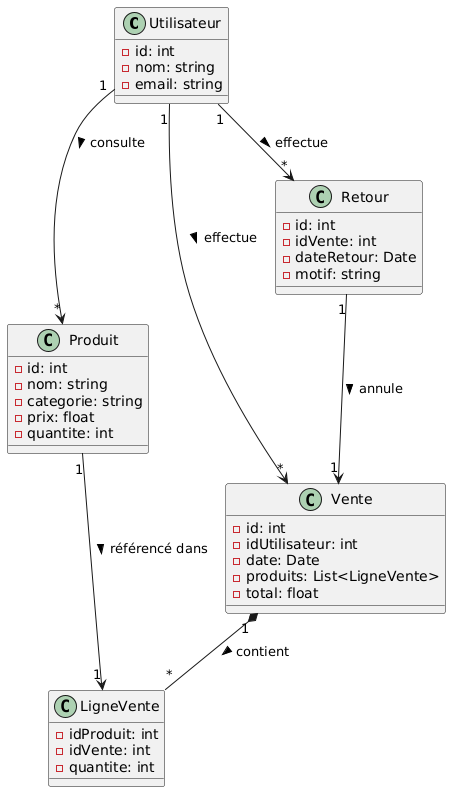
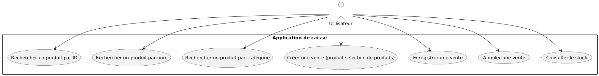
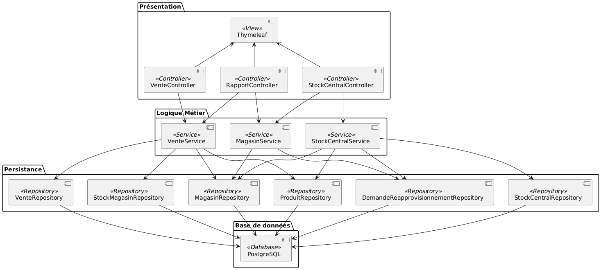
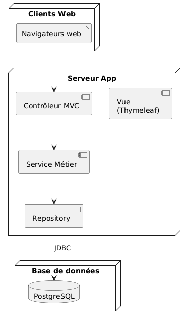
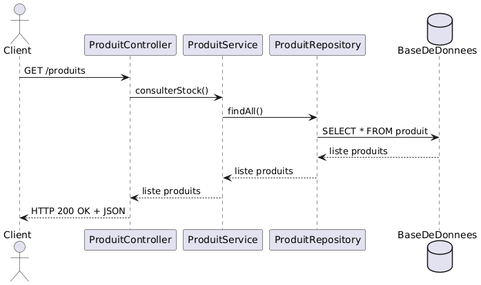
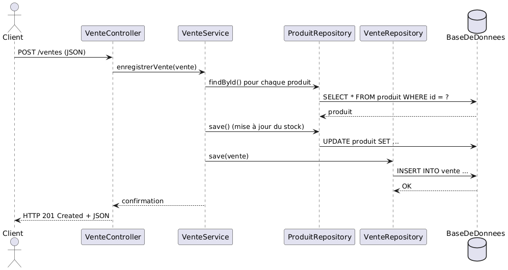
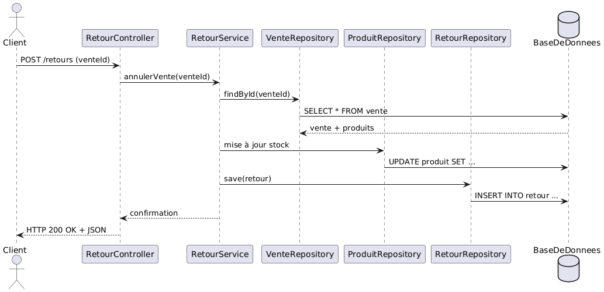
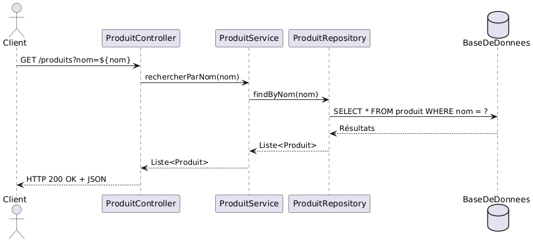

## Diagramme de classe

## Diagramme de cas d'utilisation

## Diagramme de composants

## Diagramme de deploiement

## Diagrammes de séquences

### Consulter stock

### Enregistrer vente

### Gerer Retour

### Recherche produit
